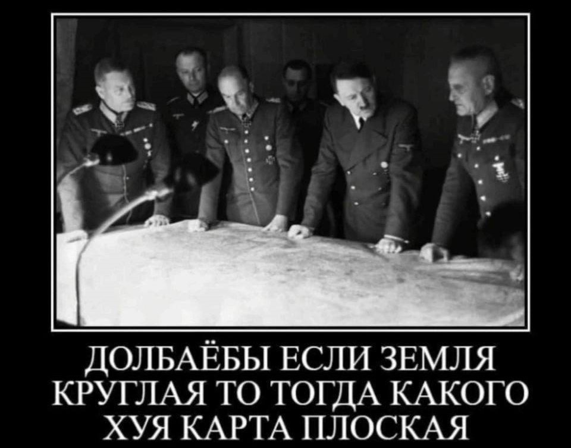
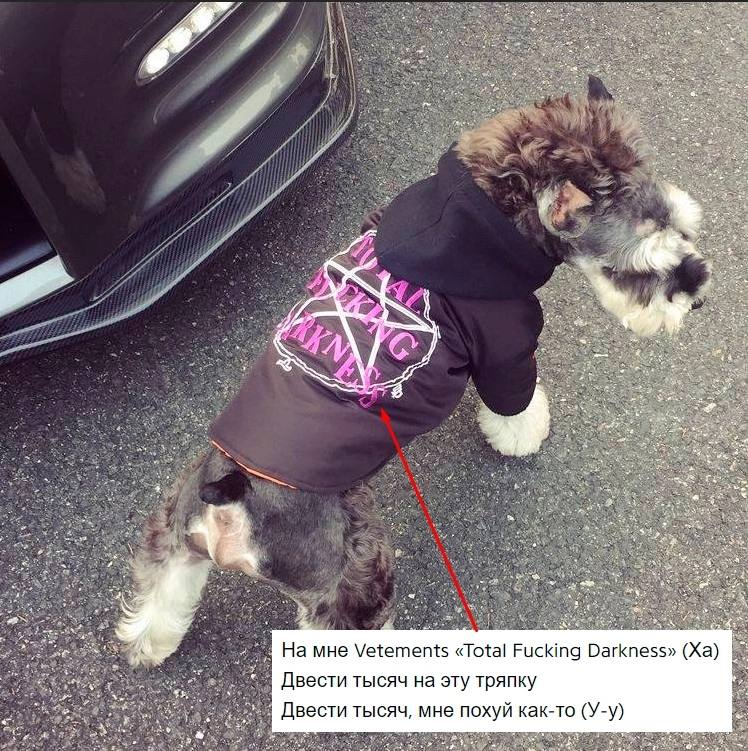
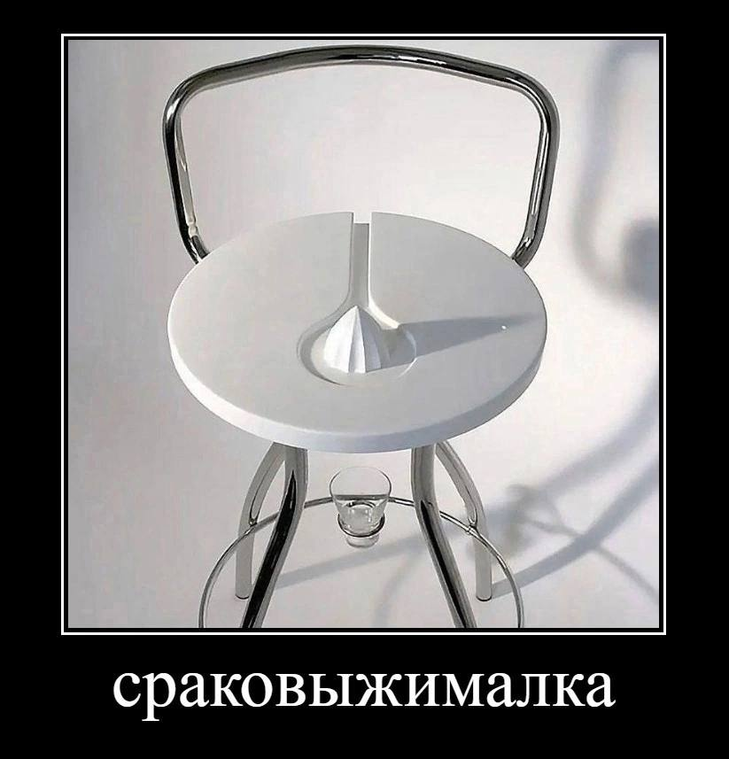
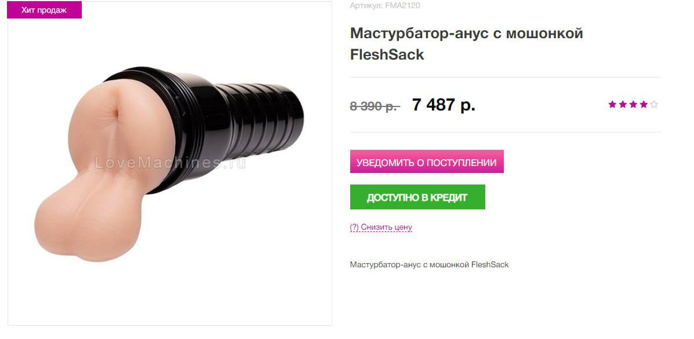
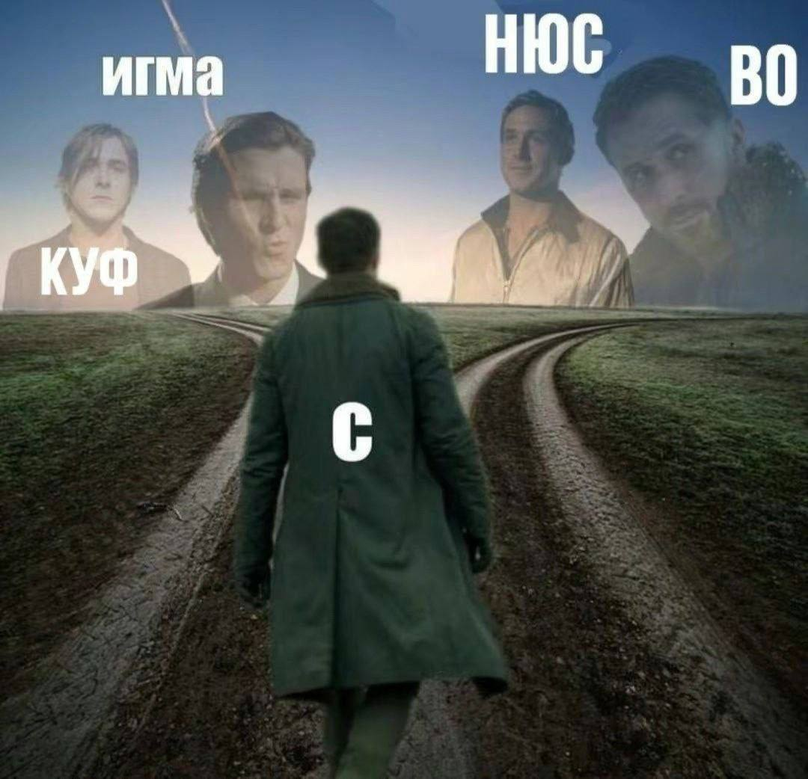

<!DOCTYPE html>
<html lang="en">
<head>
    <meta charset="UTF-8">
    <meta name="viewport" content="width=device-width, initial-scale=1.0">
    <title>bestsite</title>
    
</head>
<body>
    <h1>lineups for viper</h1>
    

        

            
1 / 228

            
            
lol

        

        

            
2 / 228

            
            
kek

        

        

            
3 / 228

            
            
sperm

        

        

            
4 / 228

            
            

        

        

            
5 / 228

            
            

        

        

            
6 / 228

            
            

        

        

            
7 / 228

            
            

        

        

            
8 / 228

            
            
sperm

        

        

            
9 / 228

            
            

        

        

            
10 / 228

            
            

        

        

            
11 / 228

            
            

        

        

            
12 / 228

            
            

        

        

            
13 / 228

            
            

        

        

            
14 / 228

            
            
sperm

        

        

            
15 / 228

            
            
sperm

        

        

            
16 / 228

            
            

        

        

            
17 / 228

            
            
sperm

        

        

            
18 / 228

            
            

        

        

            
19 / 228

            
            
sperm

        

        

            
20 / 228

            
            
sperm

        

        

            
21 / 228

            
            
sperm!

        

        

            
22 / 228

            
            
sperm

        

        

            
23 / 228

            
            
sperm

        

        

            
24 / 228

            
            
sperm

        

        

            
25 / 228

            
            

        

        

            
26 / 228

            
            

        

        

            
27 / 228

            
            
sperm

        

        

            
28 / 228

            
            
sperm

        

        

            
29 / 228

            
            
sperm

        

        

            
30 / 228

            
            
sperm

        

        

            
31 / 228

            
            
sperm

        

        

            
32 / 228

            
            

        

        

            
33 / 228

            
            
sperm

        

        

            
34 / 228

            
            

        

        

            
35 / 228

            
            
sperm

        

        

            
36 / 228

            
            
sperm

        

        

            
37 / 228

            
            

        

        

            
38 / 228

            
            

        

        

            
39 / 228

            
            

        

        

            
40 / 228

            
            

        

        

            
41 / 228

            
            

        

        

            
42 / 228

            
            

        

        

            
43 / 228

            
            

        

    

  <button class="Ascent">Ascent</button>
  

    <a href="ascent_t_side.html"><strong>T side</strong></a>
    <a href="ascent_ct_side.html" class="dropdown-link"><strong>CT side</strong></a>
  

    

      <button class="Bind">Bind</button> <!-- Создаем кнопку -->
      
 <!-- Создаем выпадающий контент -->
    <a href="bind_t_side.html"><strong>T side</strong></a> <!-- Ссылка на страницу с настройками Ascent для T side -->
    <a href="bind_ct_side.html" class="dropdown-link"><strong>CT side</strong></a> <!-- Ссылка на страницу с настройками Ascent для CT side -->
      

    

    

      <button class="Lotus">Lotus</button> <!-- Создаем кнопку -->
      
 <!-- Создаем выпадающий контент -->
    <a href="lotus_t_side.html"><strong>T side</strong></a> <!-- Ссылка на страницу с настройками Ascent для T side -->
    <a href="lotus_ct_side.html" class="dropdown-link"><strong>CT side</strong></a> <!-- Ссылка на страницу с настройками Ascent для CT side -->
      

    

    

      <button class="Breeze">Breeze</button> <!-- Создаем кнопку -->
      
 <!-- Создаем выпадающий контент -->
    <a href="breeze_t_side.html"><strong>T side</strong></a> <!-- Ссылка на страницу с настройками Ascent для T side -->
    <a href="breeze_ct_side.html" class="dropdown-link"><strong>CT side</strong></a> <!-- Ссылка на страницу с настройками Ascent для CT side -->
      

    

    

      <button class="Icebox">Icebox</button> <!-- Создаем кнопку -->
      
 <!-- Создаем выпадающий контент -->
    <a href="icebox_t_side.html"><strong>T side</strong></a> <!-- Ссылка на страницу с настройками Ascent для T side -->
    <a href="icebox_ct_side.html" class="dropdown-link"><strong>CT side</strong></a> <!-- Ссылка на страницу с настройками Ascent для CT side -->
      

    

    

      <button class="Sunset">Sunset</button> <!-- Создаем кнопку -->
      
 <!-- Создаем выпадающий контент -->
    <a href="sunset_t_side.html"><strong>T side</strong></a> <!-- Ссылка на страницу с настройками Ascent для T side -->
    <a href="sunset_ct_side.html" class="dropdown-link"><strong>CT side</strong></a> <!-- Ссылка на страницу с настройками Ascent для CT side -->
      

    

    
</body>
</html>

